# Arduino_Unconstrained_MPC_Library
This is a compact Unconstrained (linear) Model Predictive Control (MPC) library for Teensy4.0/Arduino system (or real time embedded system in general).
- It's not using Eigen (small source code - more simple to understand).
- It's not using C++ Standard Library/std (for embedded consideration).
- If you set `SYSTEM_IMPLEMENTATION` to `SYSTEM_IMPLEMENTATION_EMBEDDED_NO_PRINT` in `konfig.h`, the code is platform agnostic (not using any library beside these C header files: `stdlib.h`, `stdint.h`, and `math.h`).
- There's no malloc/new/free dynamic memory allocation (for real time application). But it use heavy stack local variables, so you need to run it through memory analyzer if you are really concerned about implement this in mission critical hard real time application.

&nbsp;

For the other versions:

- The constrained MPC version (using quadratic programming) can be found in [this repository](https://github.com/pronenewbits/Arduino_Constrained_MPC_Library/).
- The MPC with mixed-integer constraits (using branch and bound QP) version can be found in [this repository](https://github.com/pronenewbits/Embedded_Constrained_MI_MPC_Library/).

**Note**: The constrained versions are built on top of the result obtained here, so be sure to read and understand this version before read the others.

# The Background
I believe the concept and mathematics of (linear) MPC should be attainable with undergraduate control system engineering student's level of mathematical sophistication. With that in mind, I made a compact MPC library (without dependence on big library like Eigen) where the main goal is for the student to learn the MPC concept (I've made decision to sacrifice speed to get best code readability I could get) while still capable of tackling real-time control system implementation (the code is computed in **40 - 200 us**! See *Some Benchmark* section below).

First, the prediction of the system we want to control can be described as (I'm using Jan Maciejowski's *Predictive Control with Constraints* as reference, great book btw):
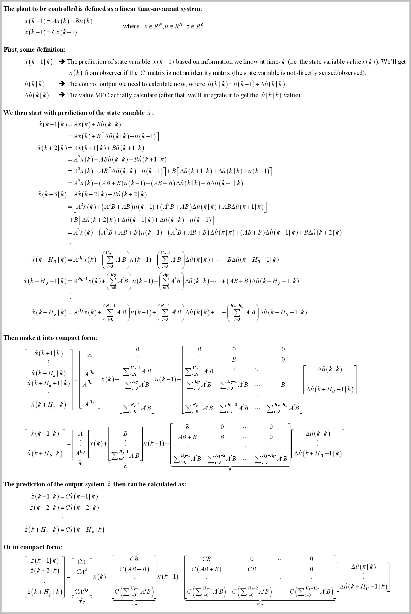

Remark: 
1. `HP` is the Prediction Horizon (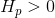). This constant determine how far ahead we'll predict the system's evolution.
2. `Hu` is the Control Horizon (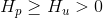). This constant determine how far ahead we'll calculate the control action.
3. As you can see on the last equation, the variable we'll calculate is 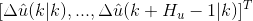. But actually we only need 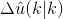 to calculate the control action . So we'll calculate all control prediction, extract , and discard the rest.

&nbsp;

Then, we can described the optimal control formulation as:
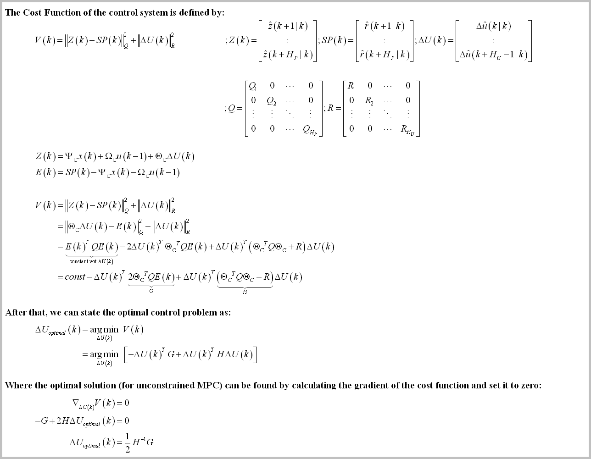

Remark: 
1. `SP(k)` is the reference value we want the system to track.
2. `Q` constant is the penalty for tracking error, because we want the tracking error to be as small as possible.
3. `R` constant is the penalty for big , because sometimes we don't want  to change as much as possible (for example, if our controller have gear inside, we don't want the control action to change rapidly to reduce wear).
4. We need the `Q` and `R` matrices to be positive-definite to ensure the optimal control formulation to be convex and have one global optimum (and also to ensure 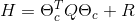 as nonzero and invertible). The simplest way to ensure that condition is to make `Q` and `R` matrices as diagonal matrix and set the diagonal entries with positive value.

# The Implementations
The implementations of the MPC control calculation consist of three main implementations, each of the implementation is self contained and calculate the same (control) output. The differences between them are in the readability, the speed, and the numerical robustness of the control algorithm. If you are still learning about MPC, I suggest you to read them all to understand the mathematics behind them.

The implementations are (from the simplest to the most advanced):
1. Naive Implementation ([mpc_engl](mpc_engl)). **Use this if you want to understand MPC (by reading the code) for the first time.**
2. Optimized version of the Naive Implementation ([mpc_opt_engl](mpc_opt_engl)). **Use this if you want the fastest implementation.**
3. The numerically robust version ([mpc_least_square_engl](mpc_least_square_engl)). **Use this if you want the most robust implementation.**

The MPC code are spread over just 5 files (`matrix.h, matrix.cpp, mpc.h, mpc.cpp, konfig.h`) - read *How to Use* section below for more explanation.

## The first implementation description: The Naive Implementation
The Naive Implementation algorithm is just a direct implementation of the MPC derivation above. The MPC algorithm can be described as (the source code can be found in "[mpc_engl](mpc_engl)" folder):

Note that the `H` matrix and (some of calculation inside) `G` matrix are actually constant. So we should be able to move them into initialization step (just need to calculate once).

## The second implementation description: Optimized version of the Naive Implementation
The optimized version is exploiting 2 facts of The Naive Implementation ([thanks to AlphaSquid_ for pointing this out](https://reddit.com/r/ControlTheory/comments/efikg6/unconstrained_mpc_library_for_arduino_and_some/fc2bp2v/)):
1. The `H` matrix and (some of calculation inside) `G` matrix (specifically the  portion) are actually constant.
2. The equation 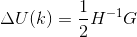 can be described as 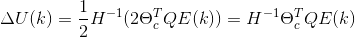. And actually we don't need all row of the (constant) matrix 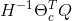 (because we only need the first M-th row to calculate ).

So we can move the optimization matrix constant into initialization stage and truncate the optimization matrix to shorten the calculation time. The MPC algorithm then can be described as (the source code can be found in "[mpc_opt_engl](mpc_opt_engl)" folder):

## The third implementation description: The Numerically Robust Version
From the numerical analysis point of view, the first & second implementation is bad because of 2 facts:
1. Inverting the `H` matrix (using Gauss-Jordan like in above implementation) is bad.
We need to change the inversion operation using mathematically equivalent operation.
2. The  matrix is often ill conditioned, so the 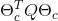 calculation is bad.
This statement stem from the fact that [squaring matrix with itself will increase its condition number](https://math.stackexchange.com/questions/1351616/condition-number-of-ata), where [the bigger condition number of a matrix is, the more ill conditioned it is](https://en.wikipedia.org/wiki/Condition_number).

We can avoid both issues by reformulate the optimal control problem as a least-squares problem (you can refer to MPC textbook for full explanation):

The MPC algorithm then can be described as (the source code can be found in "[mpc_least_square_engl](mpc_least_square_engl)"):

(I'm using householder transformation to calculate the QR decomposition).

**Some notes for this implementation**: If you set `Hp > Hu`, the linear equation of (MPC_2) above will yield sistem that is [overdetermined](https://en.wikipedia.org/wiki/Overdetermined_system). The (MPC_2) equation then can be solved with [normal equation](https://en.wikipedia.org/wiki/Overdetermined_system#Approximate_solutions) (bad) or [QR Decomposition](https://math.stackexchange.com/questions/3185239/solving-overdetermined-system-by-qr-decomposition) (good). Also the added bonus is we can truncate the `Q` & `R` matrix to lower the computation cost [(see here for more info)](https://en.wikipedia.org/wiki/QR_decomposition#Using_for_solution_to_linear_inverse_problems).

# How to Use
Just place one of the implementation folder ("[mpc\_engl](mpc_engl)", "[mpc_opt_engl](mpc_opt_engl)", or "[mpc_least_square_engl](mpc_least_square_engl)") in your Arduino installation folder and run with it! Inside each folder you will find these files:
- `matrix.h/cpp` : The backbone of all my code in this account. This files contain the class for Matrix operation.
- `mpc.h/cpp` : The source files of the MPC Class.
- `konfig.h` : The configuration file.
- `*.ino` : The arduino main file.

For custom implementation, typically you only need to modify `konfig.h` and `*.ino` files. Where basically you need to:
1. Set the length of `X, U, Z` vectors and sampling time `dt` in `konfig.h`, depends on your model.
2. Set the MPC parameters like `Hp (Prediction Horizon)` or `Hu (Control Horizon)` in `konfig.h`, depends on your application.
3. Define the (linear) matrix system `A, B, C` and MPC initialization value `weightQ, weightR` in the `*.ino` file.

After that, you only need to initialize the MPC class, set the non-zero initialization matrix by calling `MPC::vReInit(A, B, C, weightQ, weightR)` function at initialization, and call the function `MPC::bUpdate(SP, x, u)` at every sampling time to calculate the control value `u(k)`.

Don't forget to turn on Arduino Plotter for real-time plotting.

&nbsp;

*For Arduino configuration (`SYSTEM_IMPLEMENTATION` is set to `SYSTEM_IMPLEMENTATION_EMBEDDED_ARDUINO` in `konfig.h`):
The code is tested on compiler Arduino IDE 1.8.10 and hardware Teensy 4.0 Platform.

*For PC configuration (`SYSTEM_IMPLEMENTATION` is set to `SYSTEM_IMPLEMENTATION_PC` in `konfig.h`):
The code is tested on compiler Qt Creator 4.8.2 and typical PC Platform.

**Important note: For Teensy 4.0, I encounter RAM limitation where the `MATRIX_MAXIMUM_SIZE` can't be more than 28 (if you are using double precision) or 40 (if using single precision). If you already set more than that, your Teensy might be unable to be programmed (stack overflow make the bootloader program goes awry?). The solution is simply to change the `MATRIX_MAXIMUM_SIZE` to be less than that, compile & upload the code from the compiler. The IDE then will protest that it cannot find the Teensy board. DON'T PANIC. Click the program button on the Teensy board to force the bootloader to restart and download the firmware from the computer.**

# Some Benchmark
To demonstrate the code, I've made the MPC control a state-space model (HIL style) for Jet Transport Aircraft (ref: https://www.mathworks.com/help/control/ug/mimo-state-space-models.html#buv3tp8-1), where the configuration is (4 state, 2 input, 2 output LTI system) + Hp=7 & Hu=4. The compiler is Arduino IDE 1.8.10 with default setting (compiler optimization setting: faster) and the hardware is Teensy 4.0.

The computation time needed to compute one iteration of `MPC::bUpdate(SP, x, u)` function are (*drum-roll*):
1. Naive implementation (in "[mpc_engl](mpc_engl)" folder): **245 us** to compute one iteration (single precision math) or **408 us** (double precision).
2. Optimized version of the naive implementation (in "[mpc_opt_engl](mpc_opt_engl)"): **37 us** to compute one iteration (single precision math) or **65 us** (double precision).
3. The numerically robust version (in "[mpc_least_square_engl](mpc_least_square_engl)"): **195 us** to compute one iteration (single precision math) or **339 us** (double precision).

(Teensy 4.0 is wicked fast!)

The result, plotted using Scilab (you can see moving-the-output-before-the-set-point-changed characteristic unique to MPC, and the input coupling reduction mechanism):

Or if you don't want to install Scilab, you can use Arduino's Serial Plotter (with limited capability):

# Closing Remark
I hope you can test & validate my result or inform me if there are some bugs you encounter along the way! (or if you notice some grammar error in the documentation).

I published the code under CC0 license, effectively placed the code on public domain. But it will be great if you can tell me if you use the code, for what/why. That means a lot to me and give me motivation to expand the work (￣▽￣)
